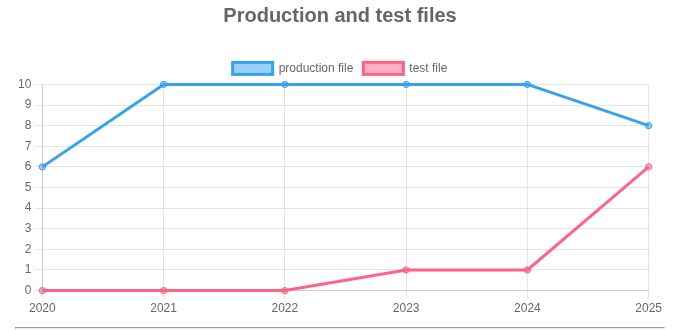
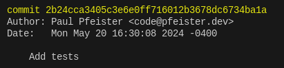
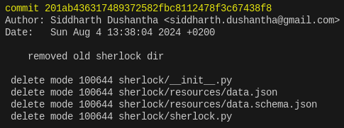
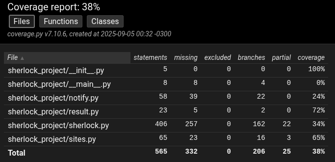

# Explorando evolução de código

Neste exercício, iremos explorar a evolução de código em sistemas reais.

Iremos utilizar a ferramenta [GitEvo](https://github.com/andrehora/gitevo).
Essa ferramenta analisa a evolução de código em repositórios Git nas linguagens Python, JavaScript, TypeScript e Java, e gera relatórios `HTML` como [este](https://andrehora.github.io/gitevo-examples/python/pandas.html).

Mais exemplos de relatórios podem ser podem ser encontrados em https://github.com/andrehora/gitevo-examples.

# Passo 1: Selecionar repositório a ser analisado

Selecione um repositório relevante na linguagem de sua preferência (Python, JavaScript, TypeScript ou Java).
Você pode encontrar projetos interessantes nos links abaixo:

- Python: https://github.com/topics/python?l=python
- JavaScript: https://github.com/topics/javascript?l=javascript
- TypeScript: https://github.com/topics/typescript?l=typescript
- Java: https://github.com/topics/java?l=java

# Passo 2: Instalar e rodar a ferramenta GitEvo

> [!NOTE]
> Antes de instalar a ferramenta, é recomendado criar e ativar um [ambiente virtual Python](https://packaging.python.org/en/latest/guides/installing-using-pip-and-virtual-environments/#create-and-use-virtual-environments).

Instale a ferramenta [GitEvo](https://github.com/andrehora/gitevo) com o comando:

```
$ pip install gitevo
```

Execute a ferramenta no repositório selecionado utilizando o comando abaixo (ajuste conforme a linguagem do repositório).
Substitua `<git_url>` pela URL do repositório que será analisado:

```shell
# Python
$ gitevo -r python <git_url>

# JavaScript
$ gitevo -r javascript <git_url>

# TypeScript
$ gitevo -r typescript <git_url>

# Java
$ gitevo -r java <git_url>
```

Por exemplo, para analisar o projeto Flask escrito em Python:

```
$ gitevo -r python https://github.com/pallets/flask
```

> [!NOTE]
> Essa etapa pode demorar alguns minutos pois o projeto será clonado e analisado localmente.

# Passo 3: Explorar o relatório de evolução de código

Após executar a ferramenta [GitEvo](https://github.com/andrehora/gitevo), é gerado um relatório `HTML` contendo diversos gráficos sobre a evolução do código.

Abra o relatório `HTML` e observe com atenção os gráficos.

# Passo 4: Explicar um gráfico de evolução de código

Selecione um dos gráficos de evolução e explique-o com suas palavras.
Por exemplo, você pode:

- Detalhar a evolução ao longo do tempo
- Detalhar se as curvas estão de acordo com boas práticas
- Explicar grandes alterações nas curvas
- Explorar a documentação do repositório em busca de explicações para grandes alterações
- etc.

Seja criativo!

# Instruções para o exercício

1. Crie um `fork` deste repositório (mais informações sobre forks [aqui](https://docs.github.com/pt/pull-requests/collaborating-with-pull-requests/working-with-forks/fork-a-repo)).
2. Adicione o relatório `HTML` no seu fork.
3. No Moodle, submeta apenas a URL do seu `fork`.

Responda às questões abaixo diretamente neste arquivo `README.md` do seu fork:

1. Repositório selecionado: [Sherlock Project](https://github.com/sherlock-project/sherlock)
2. Gráfico selecionado: 



3. Explicação: 

O gráfico escolhido foi o de comparação entre arquivos de produção e arquivos de teste, uma vez que nele podemos ver uma mudança notável de curva. Analisando a evolução do código ao longo dos anos, percebemos que entre 2020 e 2022, nenhum arquivo de teste existia, o que mudou para um único arquivo de teste durante os anos de 2022 a 2024. Porém, percebemos um aumento considerável da curva de arquivos de teste e a primeira diminuição da curva de arquivos de produção desde o início do projeto no ano de 2024. Isso pode levantar uma hipotese: O código pode ter passado por uma refatoração no último ano que focou em testes e retirada de arquivos desnecessários.

Explorando o repositório e buscando por logs relacionados a deleções de arquivos e atualizações da pasta de testes, ambos foram encontrados no ano de 2024, o que indica que essa refatoração realmente ocorreu, como mostram as imagens abaixo.




Pensando na evolução do projeto, as boas práticas pedem crescimento paralelo de código de produção e de testes desde o início, porém, aqui houve um longo atraso: 3 anos sem nenhum arquivo de teste. Também foi analisado se o débito técnico foi pago com a realização dos testes de 2024 com a geração de um report html de verificação de cobertura (do próprio pytest), e, como pode ser visto na imagem abaixo, a cobertura ainda é abaixo do recomendando: 38%. 




